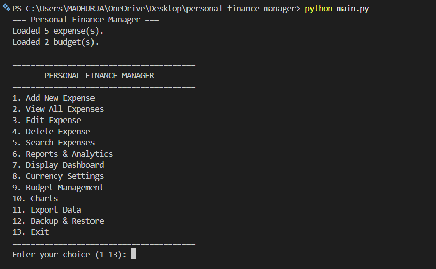
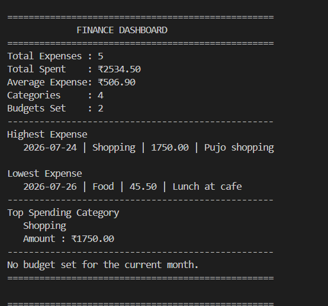
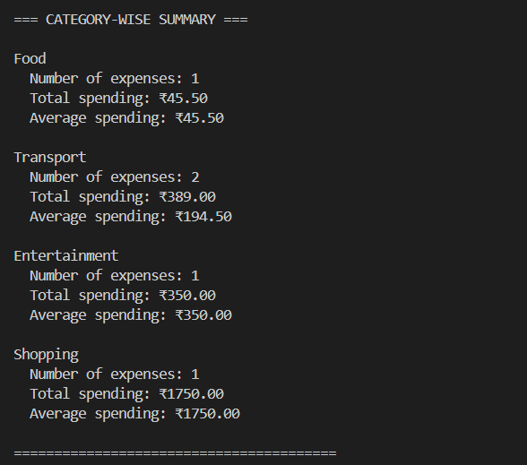
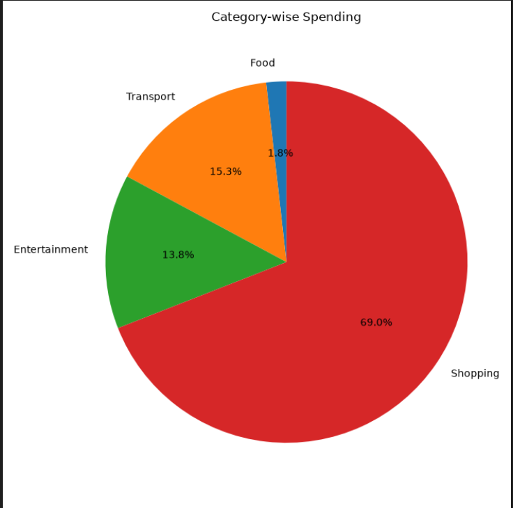
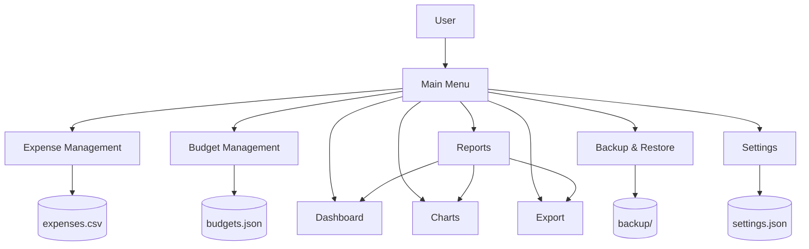
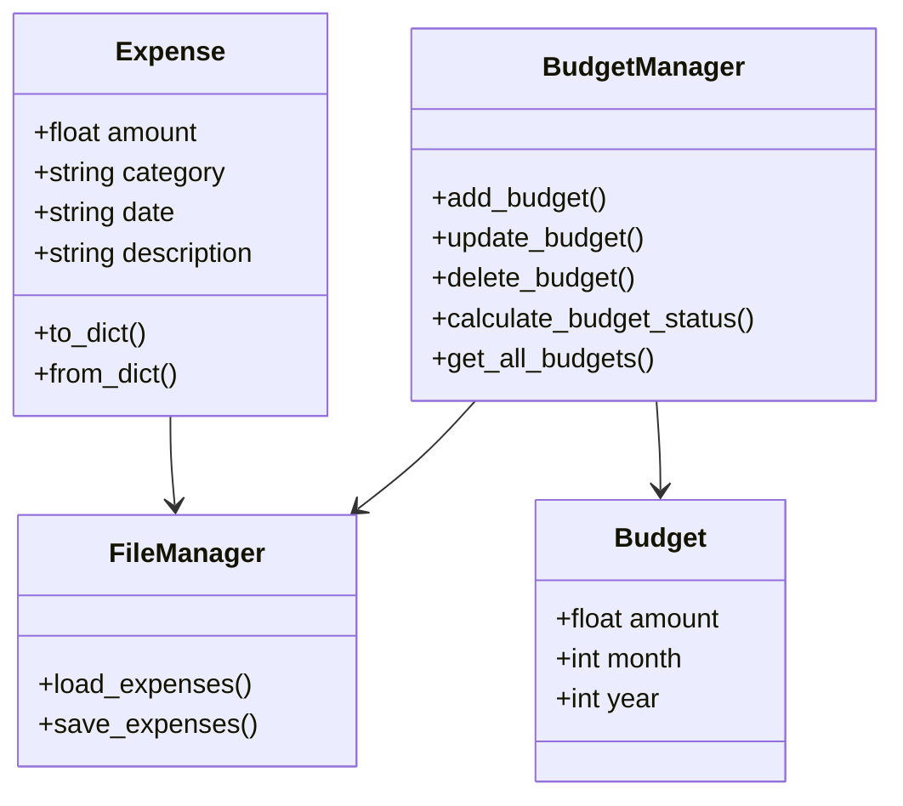
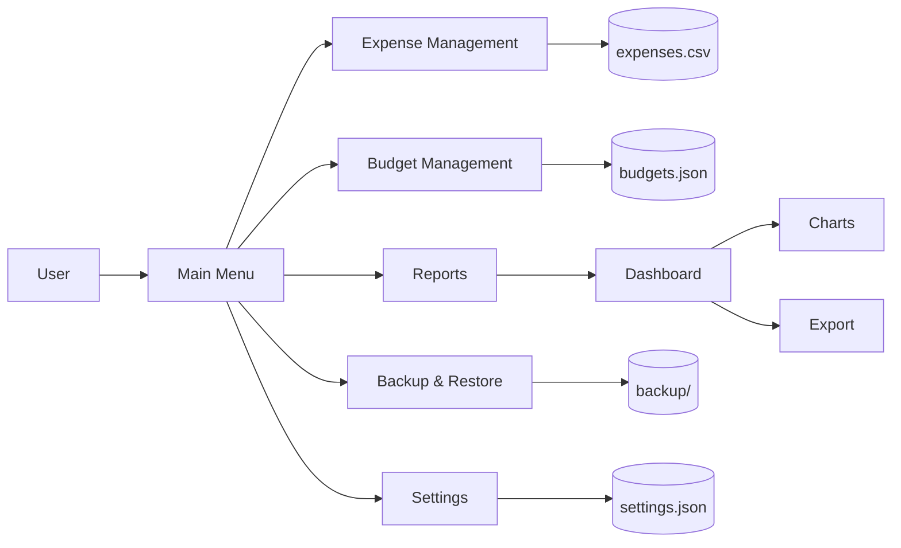
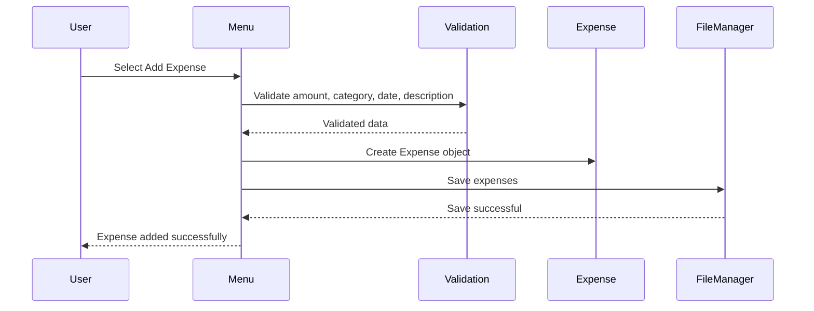

# Personal Finance Manager

A modular command-line Personal Finance Manager built with Python that enables users to track expenses, manage monthly budgets, analyse spending patterns, generate financial reports, visualise data, export records, and back up and restore application data.

---


---

## Overview

Personal Finance Manager is a modular, menu-driven command-line application developed using Python. It provides an integrated solution for recording expenses, managing monthly budgets, generating financial reports, visualising spending behaviour, exporting data, and maintaining persistent financial records.

The application follows an object-oriented and modular architecture, separating responsibilities into independent components such as expense management, budgeting, reporting, visualisation, export, configuration, backup, and dashboard modules. This design improves maintainability, scalability, and testability.

The project stores application data using CSV and JSON files while providing automatic persistence, backup, and restoration mechanisms to ensure data integrity.

---
## Table of Contents

- [Overview](#overview)
- [Features](#features)
- [System Architecture](#system-architecture)
- [UML Class Diagram](#uml-class-diagram)
- [Data Flow Diagram](#data-flow-diagram)
- [Expense Creation Workflow](#expense-creation-workflow)
- [Project Structure](#project-structure)
- [Installation](#installation)
- [Usage](#usage)
- [Screenshots](#screenshots)
- [Testing](#testing)
- [Performance Analysis](#performance-analysis)
- [Design Decisions](#design-decisions)
- [Limitations](#limitations)
- [Future Enhancements](#future-enhancements)
- [Version History](#version-history)
- [Contributing](#contributing)
- [Author](#author)
- [License](#license)


## Features

### Expense Management

- Add new expenses
- View all expenses
- Edit existing expenses
- Delete expenses
- Search expenses using multiple filters
- Input validation

### Budget Management

- Create monthly budgets
- Update budgets
- Delete budgets
- Budget utilisation monitoring
- Budget warning alerts
- Budget exceeded notifications

### Reports

- Total expenditure
- Monthly reports
- Category summary
- Highest expense
- Lowest expense
- Financial dashboard

### Data Visualisation

- Category-wise pie chart
- Monthly spending bar chart

### Data Export

- CSV Export
- JSON Export
- Text Report Export

### Data Protection

- Automatic persistence
- Backup creation
- Restore previous backups

## Screenshots

### Main Menu

The main menu provides access to the application's core functionality, including expense management, budgeting, reporting, dashboard analytics, data visualisation, export operations, backup and restore, and application settings.



### Financial Dashboard

The financial dashboard provides a consolidated overview of expense activity, including total expenses, total spending, average expense, category statistics, budget information, and highest and lowest expenses.



### Financial Reports

The reporting module provides category-wise analysis of recorded expenses, including the number of transactions, total spending, and average spending for each category.



### Data Visualisation

The application generates visual representations of spending behaviour through category-wise pie charts and monthly spending bar charts.




## System Architecture



## UML Class Diagram



## Data Flow Diagram




## Expense Creation Workflow


## Project Structure

```text
personal-finance-manager/
│
├── backup/
├── data/
│
├── docs/
│   ├── diagrams/
│   │   ├── architecture.mmd
│   │   ├── class-diagram.mmd
│   │   ├── dfd.mmd
│   │   └── sequence-diagram.mmd
│   │
│   ├── architecture.md
│   ├── developer-guide.md
│   ├── testing.md
│   └── user-guide.md
│
├── reports/
│
├── screenshots/
│   ├── charts.png
│   ├── dashboard.png
│   ├── main-menu.png
│   └── reports.png
│
├── src/
│   ├── __init__.py
│   ├── backup.py
│   ├── budget.py
│   ├── budget_file_manager.py
│   ├── budget_manager.py
│   ├── charts.py
│   ├── config.py
│   ├── dashboard.py
│   ├── expense.py
│   ├── export.py
│   ├── file_manager.py
│   ├── menu.py
│   ├── reports.py
│   └── utils.py
│
├── tests/
│
├── CHANGELOG.md
├── CONTRIBUTING.md
├── LICENSE
├── README.md
├── main.py
├── pytest.ini
└── requirements.txt
```


## Installation

Clone the repository.

```bash
git clone https://github.com/madhurjabhattacharjee479-arch/personal-finance-manager.git
```

Navigate to the project directory.

```bash
cd personal-finance-manager
```

Install dependencies.

```bash
pip install -r requirements.txt
```

Run the application.

```bash
python main.py
```

## Testing

The project uses **Pytest** for automated testing.

### Test Scope

The automated test suite covers:

- Expense validation and management
- Budget validation and management
- Budget persistence and integration
- Configuration management
- File management
- Financial reporting
- Utility functions

### Test Results

The current automated test suite contains **75 tests**, all of which pass successfully.

```text
75 passed
Run the complete test suite using:

```bash
pytest
```

The test suite is designed to verify core application functionality and help prevent regressions during future development.


## Performance Analysis

The application primarily uses in-memory lists and file-based persistence. The following complexity estimates describe the dominant operations performed on the expense and budget data.

| Operation | Time Complexity | Description |
|-----------|-----------------|-------------|
| Add Expense | O(1) | Appends a new expense to the in-memory collection |
| View Expenses | O(n) | Iterates through all stored expenses |
| Search Expenses | O(n) | Performs a linear scan of expense records |
| Edit Expense | O(n) | Searches for the target expense before updating it |
| Delete Expense | O(n) | Searches for and removes the target expense |
| Category Report | O(n) | Processes expense records to aggregate category totals |
| Monthly Report | O(n) | Processes expense records for the requested month |
| Export | O(n) | Iterates through expense records to generate the export |
| Backup | O(f) | Copies each available data file, where *f* is the number of files |

The application is designed for small to medium-sized personal datasets. For significantly larger datasets, database-backed storage and indexed queries could improve search and reporting performance.

## Design Decisions

The following design decisions were made to improve maintainability, reliability, and ease of development.

### Modular Architecture

The application is divided into independent modules responsible for specific functionality, including expense management, budgeting, reporting, dashboard generation, data visualisation, exporting, configuration, and backup operations.

This separation of responsibilities makes the codebase easier to maintain, test, and extend.

### Object-Oriented Design

Core entities such as expenses and budgets are represented using dedicated classes. This approach improves code organisation, encapsulation, and reusability.

### File-Based Persistence

Application data is stored using CSV and JSON files rather than a database. This keeps the application lightweight and portable while making the underlying data storage easy to inspect and understand.

For larger-scale deployments, database-backed storage could be introduced in a future version.

### Input Validation

User input is validated before processing to reduce invalid data and improve application stability.

### Automated Testing

Pytest is used to test core application functionality and help identify regressions during development.

### Data Visualisation

Matplotlib is used to generate category-wise and monthly spending charts. The generated charts are saved as image files for later viewing and reporting.

## Limitations

The current implementation has the following limitations:

- Application data is stored locally using CSV and JSON files.
- The application supports a single user profile.
- No authentication or user access control is implemented.
- Backup files are not encrypted or password protected.
- Charts are generated as static image files rather than interactive visualisations.
- Search operations use linear scans of stored records.
- The application does not currently provide cloud synchronisation.
- The application is designed primarily for local, single-user use rather than multi-user or distributed environments.


## Future Enhancements

Potential future improvements include:

- SQLite or PostgreSQL database integration
- User authentication and profile management
- Receipt OCR using Optical Character Recognition
- Interactive graphical user interface (GUI)
- REST API for external integrations
- Cloud synchronisation
- Machine learning-based expense prediction and spending trend analysis
- Advanced financial forecasting
- Automated recurring expense management
- Docker containerization
- Continuous Integration using GitHub Actions


## Version History

| Version | Release | Description |
|---------|---------|-------------|
| v1.0.0 | Initial Release | Expense management, budgeting, reporting, charts, dashboard, export, backup & restore, automated testing |


## Contributing

Contributions, suggestions, bug reports, and improvements are welcome.

To contribute:

1. Fork the repository.
2. Create a new feature or bug-fix branch.
3. Make your changes while following the existing project structure and coding conventions.
4. Add or update tests for any modified or newly introduced functionality.
5. Run the complete test suite and ensure that all tests pass.
6. Commit your changes using a clear and descriptive commit message.
7. Push your branch to your forked repository.
8. Open a Pull Request with a clear description of the changes and their purpose.

Before submitting a Pull Request, please ensure that:

- Existing functionality has not been unintentionally broken.
- Relevant tests have been added or updated.
- All automated tests pass successfully.
- The code follows the existing project structure and style.

## Author

**Madhurja Bhattacharjee**

Bachelor of Science in Cyber Security

Institute of Advance Education and Research (IAER)

Maulana Abul Kalam Azad University of Technology (MAKAUT)

GitHub: https://github.com/madhurjabhattacharjee479-arch

LinkedIn: https://www.linkedin.com/in/madhurja-bhattacharjee-623782322 


## License

This project is licensed under the MIT License.

See the [LICENSE](LICENSE) file for the complete license text.